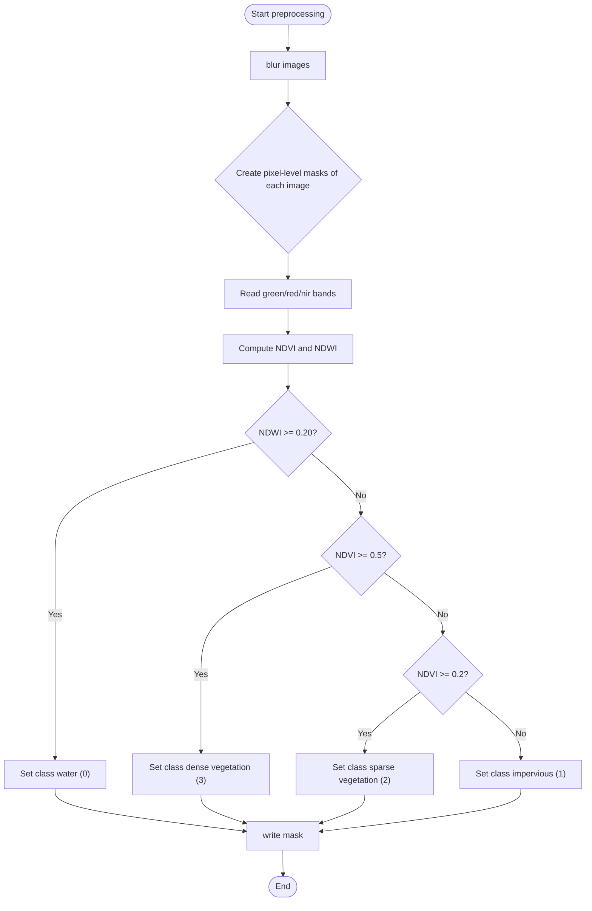
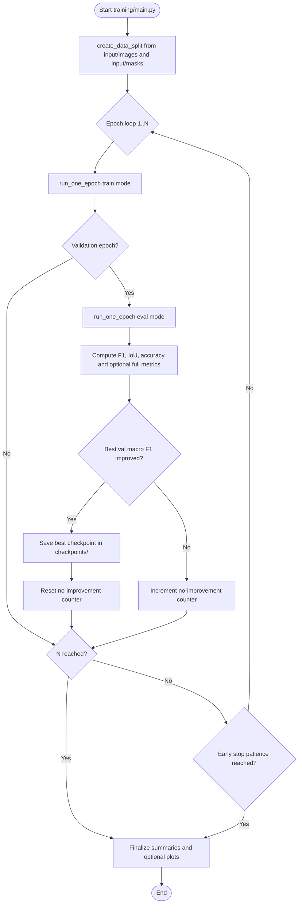
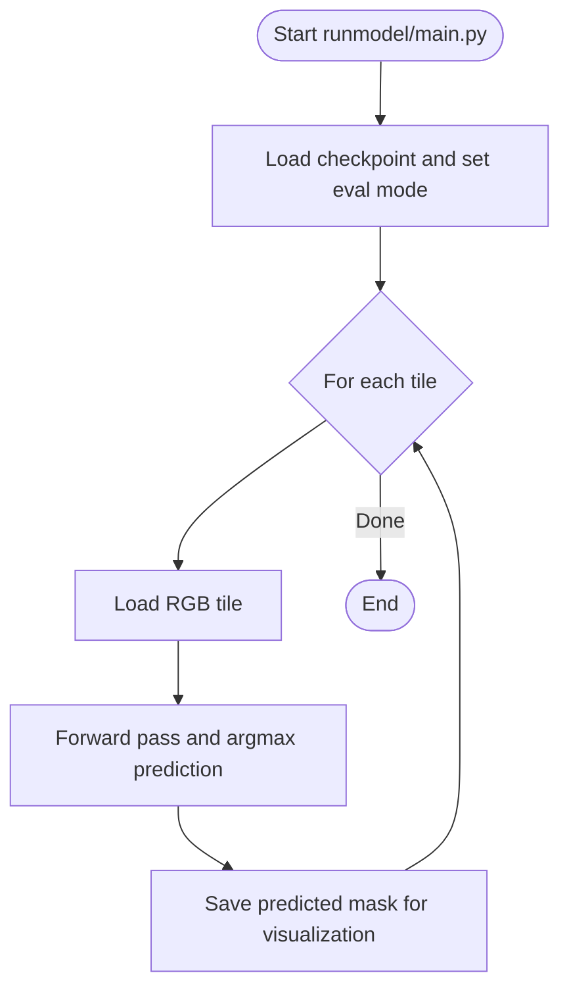
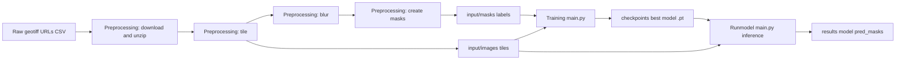
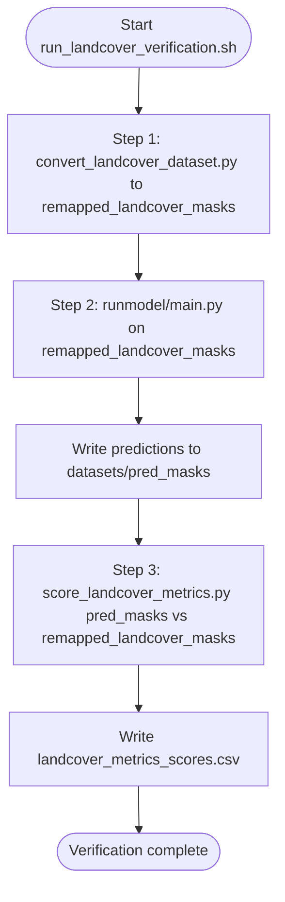

# Pipeline Flowcharts

## 1) Preprocessing

## 2) Training

## 3) Runmodel (Inference)

- Runmodel uses trained checkpoints and tile images for prediction; ground-truth masks are only needed for optional visualization comparisons.

## 4) High-Level End-to-End Flow

## 5) Landcover Verification

