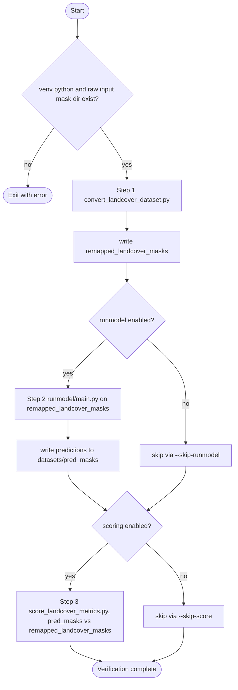

# Landcover Verification

## Pipeline flow

The end-to-end path (mirrors `run_landcover_verification.sh`) runs inference on LandCover.ai RGB tiles, aligns label spaces between predictions and ground truth using the remap steps in the flowchart, then scores overlap with F1 and IoU. Manual steps use the same data directories without going through the shell script.



GT masks may also contain label 0, which is left unchanged by `convert_landcover_dataset.py`. For script examples, see **Mask Remap Entry Point** and **Prediction Mask Remap Entry Point** below.

## Dataset Install

After downloading the LandCover.ai v1 zip archive:

1. Extract the zip.
2. Rename the extracted folder to `landcover_dataset`.
3. Place it in `./landcover_verification/datasets`.
4. Confirm masks exist at `./landcover_verification/datasets/landcover_dataset/masks`.

## Mask Remap Entry Point

Use `./landcover_verification/convert_landcover_dataset.py` to validate and remap labels:

- `1 -> 1`
- `2 -> 2`
- `3 -> 0`
- `4 -> 1`

Example:

```bash
python landcover_verification/convert_landcover_dataset.py \
  --input-dir landcover_verification/datasets/landcover_dataset/masks \
  --output-dir landcover_verification/datasets/remapped_landcover_masks
```

## Prediction Mask Remap Entry Point

Use `./landcover_verification/convert_pred_masks.py` to remap prediction labels:

- `0 -> 0`
- `1 -> 1`
- `2 -> 2`
- `3 -> 2`

Example:

```bash
python landcover_verification/convert_pred_masks.py \
  --input-dir results/unet/pred_masks \
  --output-dir landcover_verification/datasets/remapped_pred_masks
```

## F1 and IoU Scoring Entry Point

Use `./landcover_verification/score_landcover_metrics.py` to compute F1 and IoU between remapped predictions and remapped landcover GT masks.

Example:

```bash
python landcover_verification/score_landcover_metrics.py \
  --pred-dir landcover_verification/datasets/remapped_pred_masks \
  --gt-dir landcover_verification/datasets/remapped_landcover_masks \
  --out-csv landcover_verification/datasets/landcover_metrics_scores.csv
```

## End-to-End Verification Script

Run the full landcover verification flow with:

```bash
bash landcover_verification/run_landcover_verification.sh
```

This script performs:

1. `runmodel` inference with RGB input `landcover_verification/datasets/landcover_dataset/images` and output to `landcover_verification/datasets/unmapped_pred_masks`.
2. Prediction remapping via `convert_pred_masks.py` into `landcover_verification/datasets/remapped_pred_masks`.
3. Conditional GT remapping via `convert_landcover_dataset.py` if `landcover_verification/datasets/remapped_landcover_masks` is missing or empty.
4. F1/IoU scoring via `score_landcover_metrics.py`.

## New runmodel Path Args

`runmodel/main.py` now supports additional path arguments while preserving legacy defaults:

- `--images_subdir`
- `--masks_subdir`
- `--pred_subdir`
- `--images_dir` (explicit input override)
- `--masks_dir` (explicit GT override for viz)
- `--pred_output_dir` (explicit output override)
