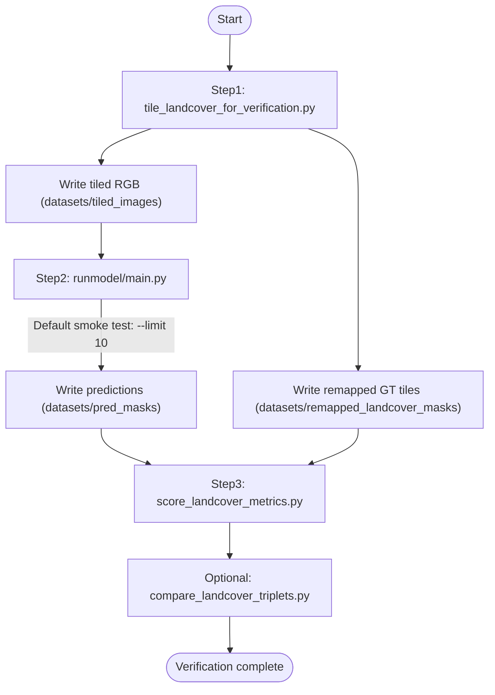

# Landcover Verification

## Pipeline flow

The end-to-end path (mirrors `run_landcover_verification.sh`) slices RGB/masks into tiles, remaps tiled GT labels, runs inference on tiled RGB, then scores overlap with F1 and IoU.



GT masks may also contain label 0, which is left unchanged by `convert_landcover_dataset.py`.

## Dataset Install

After downloading the LandCover.ai v1 zip archive:

1. Extract the zip.
2. Rename the extracted folder to `landcover_dataset`.
3. Place it in `./landcover_verification/datasets`.
4. Confirm masks exist at `./landcover_verification/datasets/landcover_dataset/masks`.

## Tile + Remap Entry Point

Use `./landcover_verification/tile_landcover_for_verification.py` to:

- Tile source RGB images into `datasets/tiled_images` (pipeline-style `{stem}_tile_{i}.tif` names).
- Tile source GT masks on the same grid.
- Remap tiled GT labels into model class order.

- `1 -> 1`
- `2 -> 2`
- `3 -> 0`
- `4 -> 1`
- `0 -> 2`

Example:

```bash
python landcover_verification/tile_landcover_for_verification.py \
  --images-dir landcover_verification/datasets/landcover_dataset/images \
  --masks-dir landcover_verification/datasets/landcover_dataset/masks \
  --out-images-dir landcover_verification/datasets/tiled_images \
  --out-remapped-masks-dir landcover_verification/datasets/remapped_landcover_masks \
  --tile-size 1000
```

## F1 and IoU Scoring Entry Point

Use `./landcover_verification/score_landcover_metrics.py` to compute F1 and IoU between predictions and remapped landcover input masks.

Example:

```bash
python landcover_verification/score_landcover_metrics.py \
  --pred-dir landcover_verification/datasets/pred_masks \
  --gt-dir landcover_verification/datasets/remapped_landcover_masks \
  --out-csv landcover_verification/datasets/landcover_metrics_scores.csv
```

## Visual Triplet Comparison (RGB, GT, Pred)

Use `./landcover_verification/compare_landcover_triplets.py` to generate per-tile PNG montages:

- Left panel: original RGB tile
- Middle panel: colored remapped GT mask
- Right panel: colored prediction mask

Example:

```bash
python landcover_verification/compare_landcover_triplets.py \
  --images-dir landcover_verification/datasets/tiled_images \
  --gt-dir landcover_verification/datasets/remapped_landcover_masks \
  --pred-dir landcover_verification/datasets/pred_masks \
  --output-dir landcover_verification/datasets/triplet_comparisons \
  --max-side 2048
```

Useful options:

- `--limit N` for quick smoke tests on first `N` matched stems.
- `--skip-missing` to skip stems where one of RGB/GT/pred is absent.
- `--max-side 0` to disable resizing (full-resolution output).

## End-to-End Verification Script

Run the full landcover verification flow with:

```bash
bash landcover_verification/run_landcover_verification.sh
```

This script performs:

1. Tile RGB and tile+remap GT via `tile_landcover_for_verification.py` into:
   - `landcover_verification/datasets/tiled_images`
   - `landcover_verification/datasets/remapped_landcover_masks`
2. Run `runmodel/main.py` on `landcover_verification/datasets/tiled_images` and write predictions to `landcover_verification/datasets/pred_masks` using **sliding-window inference** (defaults: patch `1024`, overlap `256`).
   - Default quick test: `--limit 10` tiles.
3. Score F1/IoU via `score_landcover_metrics.py` using:
   - `--pred-dir landcover_verification/datasets/pred_masks`
   - `--gt-dir landcover_verification/datasets/remapped_landcover_masks`

Optional flags:

- `--skip-tile`
- `--skip-runmodel`
- `--skip-score`
- `--runmodel-limit N` (default `10`, set `0` for all tiles)
- `--tile-size N` (default `1000`)
- `--inference-patch-size N` — sliding-window edge length in pixels (default `1024`). Use `0` only if you want a single full-image forward (often **CUDA OOM** on landcover-sized tiles).
- `--inference-overlap N` — overlap between windows (default `256`). Must be less than patch size when patch size is greater than `0`; must be `0` when patch size is `0`.

**CUDA OOM:** Full-tile inference (`--inference-patch-size 0` in `runmodel`) loads the entire ~9k×9k raster through the U-Net encoder; activations exceed typical 8&nbsp;GB GPUs. The verification script therefore passes patched inference by default.

**Tuning memory:** If inference still OOMs, lower patch size (must be a multiple of `32`) and overlap proportionally, e.g. `768` / `192` or `512` / `128`:

```bash
LANDCOVER_INFERENCE_PATCH_SIZE=768 LANDCOVER_INFERENCE_OVERLAP=192 \
  bash landcover_verification/run_landcover_verification.sh --skip-tile
```

Or:

```bash
bash landcover_verification/run_landcover_verification.sh \
  --inference-patch-size 512 --inference-overlap 128
```

PyTorch may also suggest `PYTORCH_ALLOC_CONF=expandable_segments:True` to reduce fragmentation; patching is the primary fix.

## New runmodel Path Args

`runmodel/main.py` now supports additional path arguments while preserving legacy defaults:

- `--images_subdir`
- `--masks_subdir`
- `--pred_subdir`
- `--images_dir` (explicit input override)
- `--masks_dir` (explicit GT override for viz)
- `--pred_output_dir` (explicit output override)
- `--inference-patch-size` / `--inference-overlap` (sliding-window inference; verification script sets these by default)
