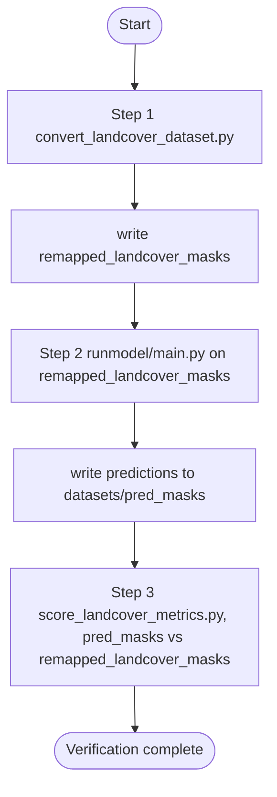

# Landcover Verification

## Pipeline flow

The end-to-end path (mirrors `run_landcover_verification.sh`) remaps LandCover.ai masks, runs inference on those remapped masks, then scores overlap with F1 and IoU. Manual steps use the same data directories without going through the shell script.



GT masks may also contain label 0, which is left unchanged by `convert_landcover_dataset.py`.

## Dataset Install

After downloading the LandCover.ai v1 zip archive:

1. Extract the zip.
2. Rename the extracted folder to `landcover_dataset`.
3. Place it in `./landcover_verification/datasets`.
4. Confirm masks exist at `./landcover_verification/datasets/landcover_dataset/masks`.

## Mask Remap Entry Point

Use `./landcover_verification/convert_landcover_dataset.py` to validate and remap labels:

- `1 -> 1`
- `2 -> 2`
- `3 -> 0`
- `4 -> 1`

Example:

```bash
python landcover_verification/convert_landcover_dataset.py \
  --input-dir landcover_verification/datasets/landcover_dataset/masks \
  --output-dir landcover_verification/datasets/remapped_landcover_masks
```

## F1 and IoU Scoring Entry Point

Use `./landcover_verification/score_landcover_metrics.py` to compute F1 and IoU between predictions and remapped landcover input masks.

Example:

```bash
python landcover_verification/score_landcover_metrics.py \
  --pred-dir landcover_verification/datasets/pred_masks \
  --gt-dir landcover_verification/datasets/remapped_landcover_masks \
  --out-csv landcover_verification/datasets/landcover_metrics_scores.csv
```

## End-to-End Verification Script

Run the full landcover verification flow with:

```bash
bash landcover_verification/run_landcover_verification.sh
```

This script performs:

1. Remap input masks via `convert_landcover_dataset.py` into `landcover_verification/datasets/remapped_landcover_masks`.
2. Run `runmodel/main.py` on `landcover_verification/datasets/remapped_landcover_masks` and write predictions to `landcover_verification/datasets/pred_masks`.
3. Score F1/IoU via `score_landcover_metrics.py` using:
   - `--pred-dir landcover_verification/datasets/pred_masks`
   - `--gt-dir landcover_verification/datasets/remapped_landcover_masks`

Optional flags:

- `--skip-remap-input-masks`
- `--skip-runmodel`
- `--skip-score`

## New runmodel Path Args

`runmodel/main.py` now supports additional path arguments while preserving legacy defaults:

- `--images_subdir`
- `--masks_subdir`
- `--pred_subdir`
- `--images_dir` (explicit input override)
- `--masks_dir` (explicit GT override for viz)
- `--pred_output_dir` (explicit output override)
